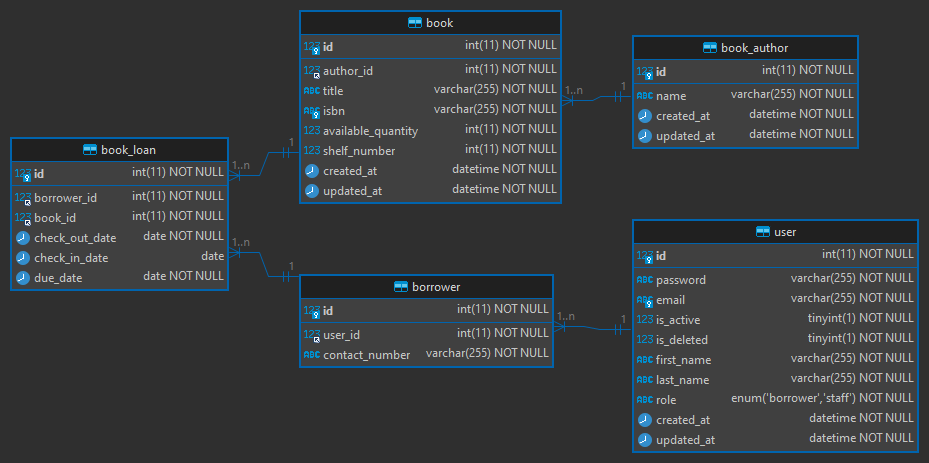

# Library Management System

A simple library management system to manage books and borrowers.

## Table of Contents

- [Functional Requirements](#functional-requirements)
  - [Books](#books)
  - [Borrowers](#borrowers)
  - [Borrowing Process ( Loans )](#borrowing-process---loans--)
- [Non-functional Requirements](#non-functional-requirements)
  - [Performance](#performance)
  - [Scalability](#scalability)
  - [Extensibility](#extensibility)
  - [Security](#security)
- [Tools Used](#tools-used)
- [Getting Started](#getting-started)
  - [Running The API](#running-the-api)
  - [Access The API Documentation](#access-the-api-documentation)
- [Database Schema](#database-schema)
- [Project Structure](#project-structure)

## Functional Requirements

### Books

- Add a book with details like title, author, ISBN, available quantity, and shelf location.
- Update a book’s details.
- Delete a book.
- List all books.
- Search for a book by title, author, or ISBN.

### Borrowers

- Register a borrower with details like name, email, and registered date (Keep the user details as simple as possible).
- Update borrower’s details.
- Delete a borrower.
- List all borrowers.

### Borrowing Process ( Loans )

- A borrower can check out a book. The system should keep track of which books are checked out and by whom.
- A borrower can return a book.
- A borrower can check the books they currently have.
- The system should keep track of due dates for the books and list books that are overdue

## Non-functional Requirements

### Performance

The system should be optimized for reading operations since searching and listing books/borrowers will be frequent operations. This is done by adding a full-text search index on the title and author name fields. This index will speed up the read requests in favor of the less likely used write requests. For better scalability, a standalone search database could be used e.g. _Elasticsearch_. Which could be used for the searching endpoints to retrieve documents faster. Moreover, _Elasticsearch_ supports horizontal scalability which will increase the reliability and availability of the system.

### Scalability

The API server is a stateless app making it easier to scale up and down with the load. For future improvement, a `node-exporter` module could be integrated to aggregate metrics about the API like response time and memory usage to determine bottlenecks and set scaling policy.

### Extensibility

The database schema is open for extensibility by adding reviews, reservations, and staff. Also, the modular structure of the project helps in adding new modules easily. Checkout the [Project Structure](#project-structure), and [Database Schema](#database-schema) sections for more about it.

### Security

**Currently implemented**

- All the API endpoint inputs are validated to ensure better security.
- A robust error handling is implemented to handle most user errors and prevent leaking any information on unhandled errors.
- The API adds security headers to every request.

**Future improvements**

- Refresh tokens could be used to allow scalable user logouts, and prevent multiple login requests during a session.
- Distributed rate limiting using a _Redis_ backend could be implemented to lock user accounts to prevent password guessing. Also could be used to block DoS attacks.

## Technologies Used

- NodeJs
- ExpressJs
- MySQL
- Github Actions
- Docker

## Getting Started

### Running The API

1. Rename the `.env.example` file to `.env`.
2. Run the Docker compose command below which will set up a database, seed it, and run the API server after that. You can remove the `seed-db` service to use the API on your own.

   ```bash
   docker-compose up
   ```

   | User              | Roles    |
   | ----------------- | -------- |
   | borrower@test.com | borrower |
   | staff@test.com    | staff    |

<aside>
💡 All seeds users have the same password: `123456789`
</aside>

### Access The API Documentation

You can access the API docs at this local URL: http://localhost:3000/docs/

## Database Schema

<p align="center">
  
</p>

## Project Structure

```bash
├───.github
│   └───workflows             <- GitHub templates and CI files.
└───src                       <- Contains App code.
    ├───db
    │   └───migrations
    ├───docs                  <- Auto-generated API docs.
    │   └───assets
    ├───middlewares           <- Common middlewares between modules.
    ├───modules               <- Contains a module for each entity.
    │   ├───auth
    │   ├───book
    │   │   ├── book.controller.js
    │   │   ├── book.model.js
    │   │   ├── book.route.js
    │   │   ├── book.service.js
    │   │   └── index.js      <- Contains exports from module
    │   ├───bookAuthor
    │   ├───bookLoan
    │   ├───borrower
    │   ├───health
    │   └───user
    ├───routes
    ├───utils
    │   └───exceptions
	├─── logger.js
	├─── config.js
	├─── seeder.js
	├─── app.js
    └─── server.js
```
